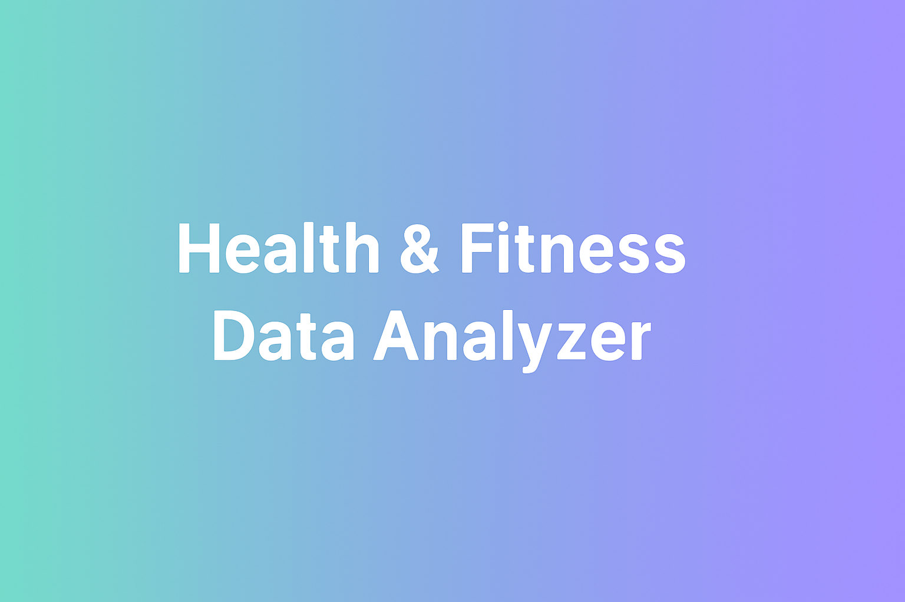
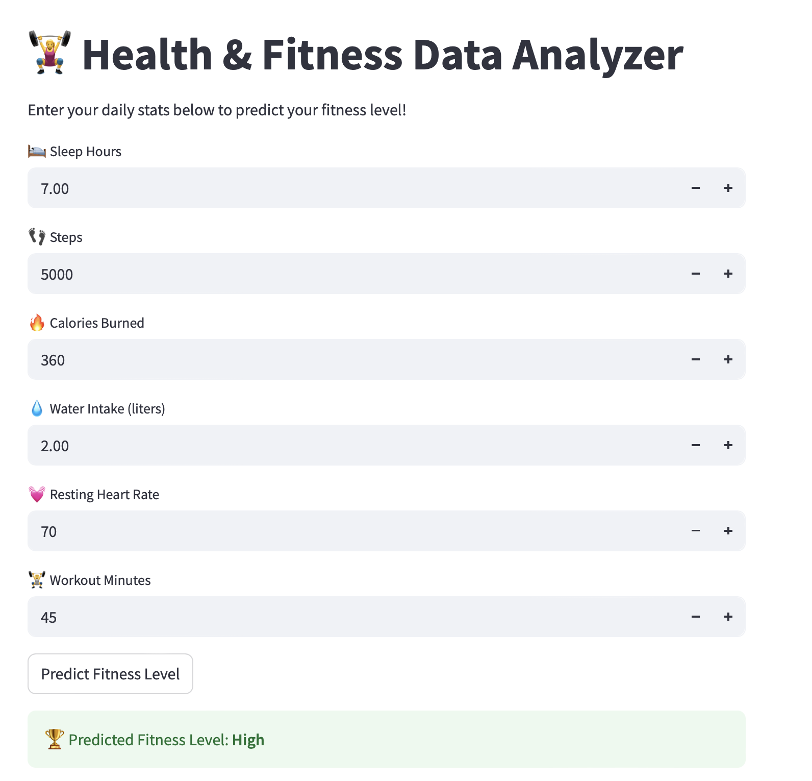

# Health & Fitness Data Analyzer

This project analyzes daily health data (sleep, steps, water, calories) and predicts fitness levels using Python + Machine Learning.

## 📑 Table of Contents
- [About the Project](#about-the-project)
- [Dataset Description](#dataset-description)
- [Tech Stack](#tech-stack)
- [Reflections](#project-reflections)
- [Future Work](#future-work)

## 🩺 About the Project  
This project is part of my learning journey in Data Analysis and Machine Learning.  
It aims to help visualize and understand the relationships between daily health habits and overall fitness levels.

## 📊 Dataset Description  
The dataset `fitness_data.csv` includes the following columns:
- `date` — Day of data recording  
- `sleep_hours` — Total hours of sleep  
- `steps` — Number of steps taken  
- `calories` — Calories consumed  
- `water_liters` — Daily water intake  
- `resting_hr` — Resting heart rate  
- `workout_minutes` — Duration of exercise  
- `fitness_level` — Categorical label (Good / Average / Poor)

## 💻 Tech Stack  
- **Language:** Python  
- **Libraries:** pandas, numpy, matplotlib, seaborn  
- **Database:** SQLite (planned for later)  
- **Version Control:** Git & GitHub

## 🚀 Future Work  
- Integrate SQLite database to store data dynamically  
- Build an ML model to predict fitness level from daily inputs  
- Develop an interactive dashboard for data visualization  

## 🚀 How to Run This Project

1. **Clone the repository**
   ```bash
   git clone https://github.com/synadshah2213/health-fitness-data-analyzer.git
   cd health-fitness-data-analyzer
 -  - 

<p align="center">
  
</p>

## 🖼️ Demo Preview
Here’s a look at the app in action 👇

<p align="center">
  
</p>
